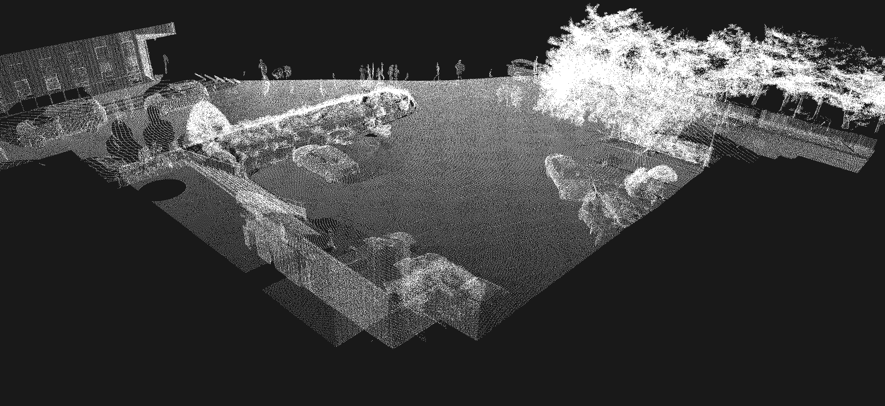
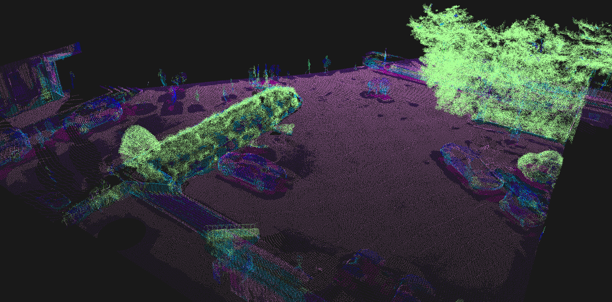

# PointNet for SemanticKITTI
This project implements **3D semantic segmentation** on the [SemanticKITTI](https://semantic-kitti.org/) dataset using the **PointNet architecture**.  
The goal was to understand **PointNet** architecture and to test the performance of the **RX 9070 XT** GPU.

---

## Tech Stack

### Python modules
- **PyTorch** - model training and evaluation
- **SemanticKITTI** - dataset
- **Numpy / SciPy** - preprocessing utilities
- **Pandas** - datahandeling and saving

### Rust modules
- **Kiss3d** - visualization of pointclouds
- **pcl_rs** - reading .pcl files
- **Maturin** - creating Python modules

---

# Pictures and Results
We can see that PointNet could somewhat tell what vegetation is but had in general problems with distinguishing humans/motorcycles and buildings in a completlely new dataset. This issue could be exacerbated by using the use of different LiDAR systems. 


Before and after the segmentation the colors represent one of it's 25 outputs. I used similar colors to semantic-kittis dataset.

---

## Usage
There are two models uploaded in the models folder best_model.pth was saved as early stoppage while model_250.pth was the latest.
The project was developed with Python package manager **UV**.

### Installation
```bash
git clone https://github.com/MaximMicanovic/pointnet_semantickitti
cd pointnet_semantikitti
uv run
